Uso del Terminal e introduccion a GitHub
=======================

En este tutorial aprenderan las instrucciones basicas a usar en el terminal de la computadora, crear su cuenta de GitHub y entender las instrucciones basicas de Git.

__________________________________________________

Terminal de la computadora
-------------------------

Un terminal en una computadora, es una interface en donde los usuarios escriben instrucciones para controlar la computadora en cierta localizacion. Usualmente, las personas estan acostumbradas a utilizar la computadora a traves de interfaces graficas, utilizando el mouse y el teclado. Sin embargo, esa no es la unica manera de utilizar la computadora. Utilizando el terminal se pueden hacer muchas de las tareas que se hacen con el mouse y el teclado, sin ningun interfaz grafico que ayude a visualizar el uso de la computadora.  

En un terminal, se pueden correr programas, abrir, editar, copiar y mover documentos a diferentes lugares dentro de la computadora. Es importante entender que el terminal siempre ejecuta las instrucciones en una ubicacion exacta de la computadora. El lugar en donde se ejecutan estas instruciones se conoce como la direccion de directorio. Para poder entender la direccion de directorio mejor, es necesario entender la manera en que los documentos y directorios se organizan dentro de la computadora y como navegar en esta estructura.

### Instruccion *cd* (Change Directory)
La organizacion de documentos y directorios en una computadora tiene la estructura parecida a la de un arbol. Todas las computadoras tienen un directorio raiz en el que toda la informacion esta guardada. Dentro de ese directorio, existen mas directorios y documentos y asi sucesivamente continua la estructura de los directorios y documentos en una computadora.

 
<figure>
    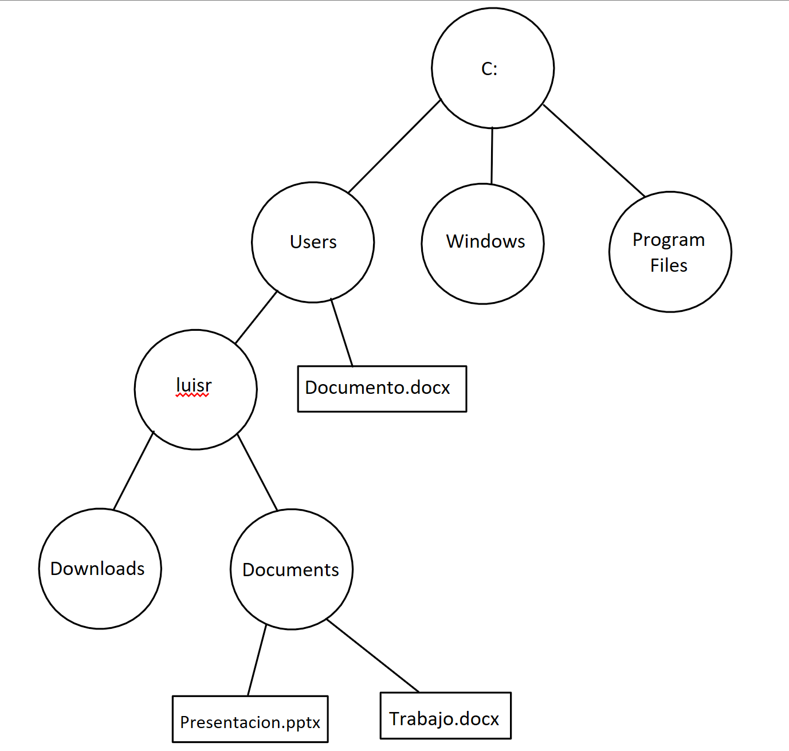
    <figcaption>Estructura de la organizacion de directorios y documentos. Los circulos representan directorios y los rectangulos representan documentos.</figcaption>
</figure>
 

Utilizando el interfaz grafico, navegar desde el directorio raiz hasta Documentos se veria de la siguiente manera en Windows:

|<figure>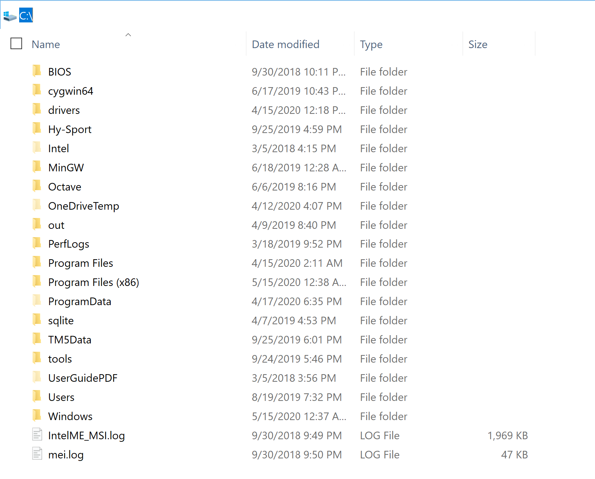<figcaption><b>Figura 1</b> - Directorio de la Computadora</figcaption></figure>|<figure>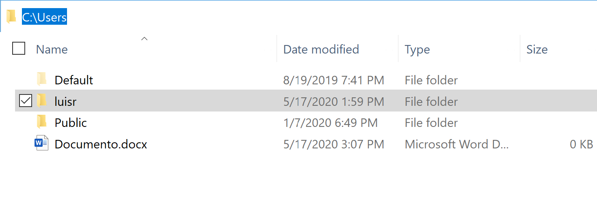<figcaption><b>Figura 2</b> - Directorio Users</figcaption></figure>|
|---|---|
|<figure>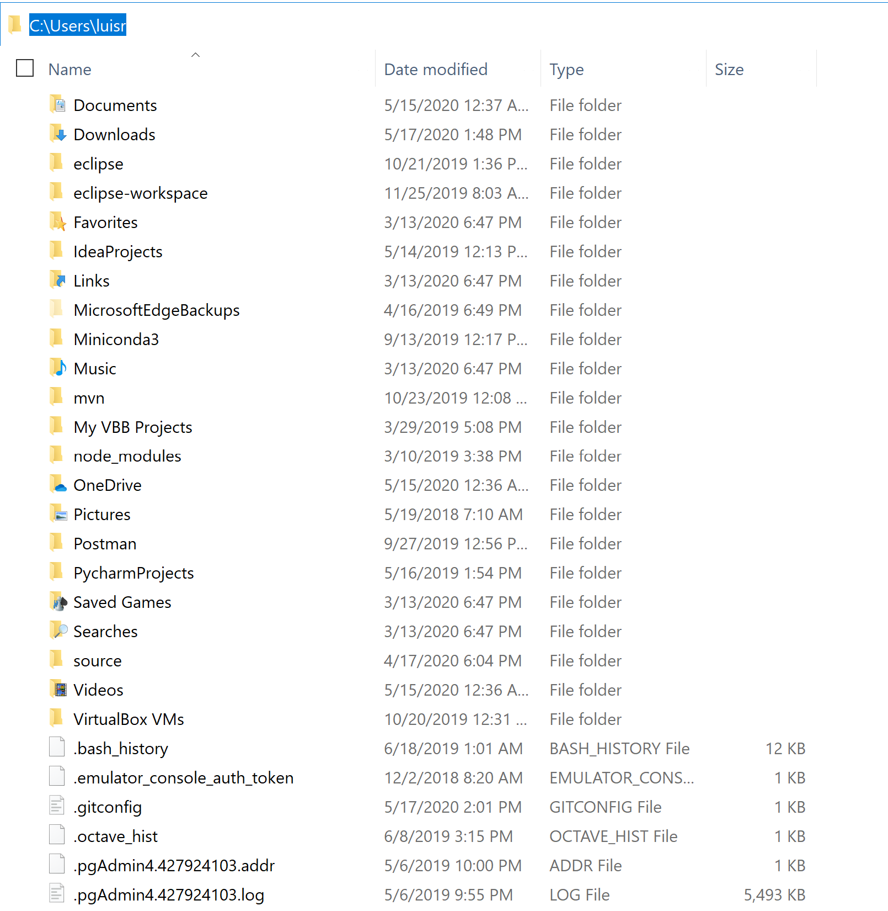<figcaption><b>Figura 3</b> - Directorio luisr</figcaption></figure>|<figure>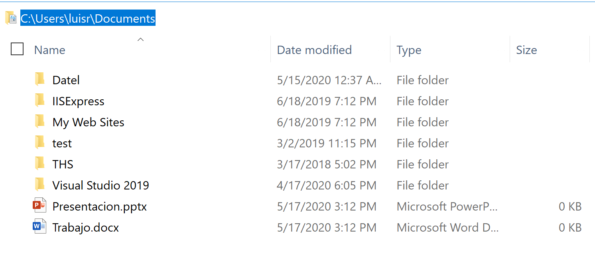<figcaption><b>Figura 4</b> - Directorio Documents</figcaption></figure>|

Sin embargo, en el terminal, para accesar el directorio **Documents** desde el directorio raiz, se utiliza la instruccion cd, la cual se utiliza para moverse entre los diferentes directorios de la computadora.

En este ejemplo, para accesar al directorio documents desde el directorio raiz se puede utilizar la siguiente instruccion:

            cd Users\luisr\Documents

<figure>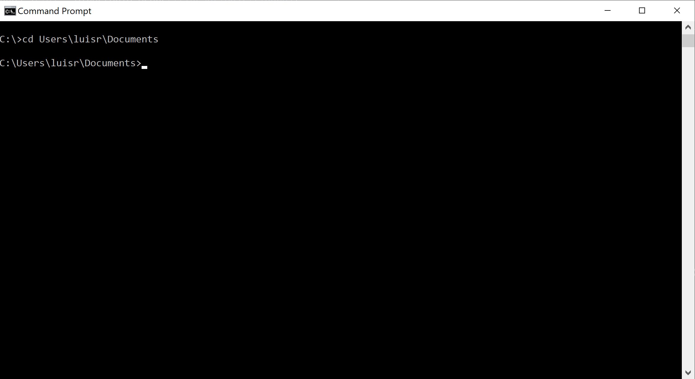<figcaption><b>Figura 5</b> - Instruccion cd</figcaption></figure>

En el terminal de la computadora Mac, los "\\" se reemplazan con "/" para dividir los directorios. 

### Instruccion ls/dir

La instruccion **ls** en el terminal de Mac se utiliza para mostrar todos los directorios y documentos que existen en un directorio. Sin embargo, en el terminal de Windows, se utiliza otra instruccion; la instruccion **dir**. A diferencia de la instruccion **ls**, la instruccion **dir** muestra la ultima fecha en que se modifico el directorio o documento y diferencia los directorios de los documentos.

<figure>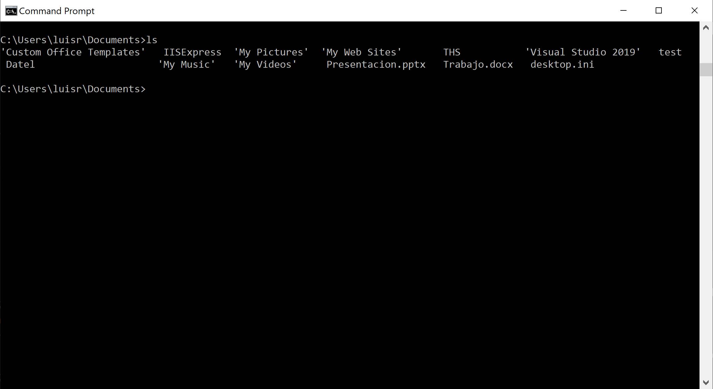<figcaption><b>Figura 6</b> - **ls** en Mac</figcaption></figure><figure>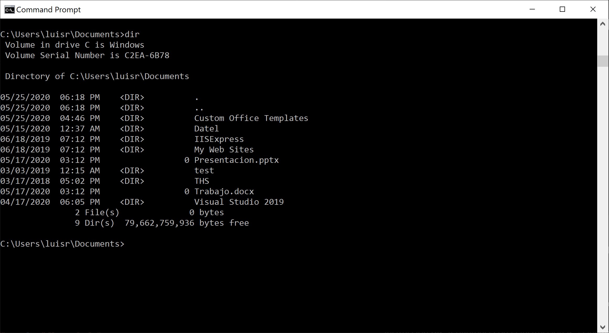<figcaption><b>Figura 7</b> - **dir** en Windows</figcaption></figure>

### Instruccion mkdir/md

La instruccion **mkdir** en Mac se utiliza para crear un nuevo directorio dentro del directorio actual. Sin embargo, en Windows la instruccion con la misma funcion es la instruccion **md**. 

En Mac, se utiliza de la siguiente manera:

            mkdir NombreDelDirectorio

Y en Windows de esta manera:

            md NombreDelDirectorio

Para practicar estas diferentes instrucciones,  haremos el siguiente ejecricio de practica:

1. Abre el terminal de tu respectivo sistema operativo (Command Prompt en Windows o Terminal en Mac).

2. Si estas utiizando Mac, escribe la instruccion **pwd**, para que el terminal te muestre el directorio en el que te encuentras. Si estas utilizando Windows, para hacer esto mismo, escribe la instruccion **cd**, cuando no escribes nada mas con **cd**, su funcionalidad es la misma que **pwd** en Mac. 

Mac:

            pwd

Windows:

            cd

* Si estas en Mac, y la respuesta del terminal es ***/Users/NombreDeUsuario***, en donde ***NombreDeUsuario*** es el nombre de usuario que tienes en la computadora, estas en el directorio correcto. Si no estas en este directorio, escribe la instruccion ***cd /Users/NombreDeUsuario*** para llegar al directorio correcto.

* Si estas en Windows y la respuesta del terminal es ***C:\Users\NombreDeUsuario***, en donde ***NombreDeUsuario*** es el nombre de usuario que tienes en la computadora, estas en el directorio correcto.  Si no estas en este directorio, escribe la instruccion ***cd C:\Users\NombreDeUsuario*** para llegar al directorio correcto.

3. Escribe la instruccion ***cd Documents*** para acceder al directorio documents de la computadora.

4. Escribe la instruccion (***ls*** si estas en Mac, ***dir*** si estas en Windows) para poder ver todos los directorios y documentos que existen en el directorio *Documents*. 

5. Escribe la instruccion de crear un directorio (***mkdir*** si estas en Mac, ***md*** si estas en Windows) con el nombre HelloWorld.

Mac:

            mkdir HelloWorld

Windows:

            md HelloWorld

6. Para confirmar que el directorio se creo, utiliza la instruccion ***cd*** para acceder a el y luego utiliza la instruccion del paso 2 para confirmar que estas en el directorio que acabas de crear.

*            cd HelloWorld

Mac:

*           pwd

Windows:

*           cd

    *  Si estas en Mac, y la respuesta del terminal es ***/Users/NombreDeUsuario/Documents/HelloWorld***, en donde ***NombreDeUsuario*** es el nombre de usuario que tienes en la computadora, estas en el directorio correcto.

    * Si estas en Windows y la respuesta del terminal es ***C:\Users\NombreDeUsuario\HelloWorld***, en donde ***NombreDeUsuario*** es el nombre de usuario que tienes en la computadora, estas en el directorio correcto.

_________________________________________________________

Repositorios en Github y Git
-----------------------

### Que es Git?

Git es un programa que se utiliza para rastrear los cambios en documentos de un proyecto.

### Que es un repositorio?

Un repositorio es el lugar en donde los proyectos se guardan y se utiliza Git para rastrear los cambios de documentos y facilitar la colaboracion entre las personas trabajando en el proyecto. 

### Que es GitHub?

GitHub es una pagina de Internet en donde se guardan repositorios, de manera que no queden guardados solo en las computadoras y sea facil la colaboracion entre compañeros. Un ejemplo parecido a un repositorio en GitHub seria un directorio dentro de Google Drive.

### Instrucciones de Git
Para subir documentos a los repositorios en GitHub, se utilizan las instrucciones de Git. Algunas de estas son las siguientes:

|Instruccion|Definicion|Ejemplo
|---|---|---|
|checkout|Cambia a una revision especifica|`git checkout origin/master`|
|add|Añade documentos a la lista a subir al repositorio|`git add .`|
|clone|Clona el repositorio al directorio actual|`git clone https://github.com/morcom-effect/codigo-m.git`|
|pull|Descarga los cambios que se subieron al repositorios por ultima vez|`git pull`|
|push|Publica la revision al repositorio|`git push`|
|commit|Crea una revision con la lista de cambios echa por la instruccion add|`git commit -m "mensaje de commit"`|

### Crea una cuenta de GitHub

Para crear una cuenta de GitHub sigue estos pasos:

<figure><figcaption><b>Paso 1</b> - Ve a la pagina github.com y llena la informacion que aparece para "Sign up for GitHub"</figcaption></figure>

<figure><figcaption><b>Paso 2</b> - Selecciona Student en la primera lista de opciones</figcaption></figure>

<figure>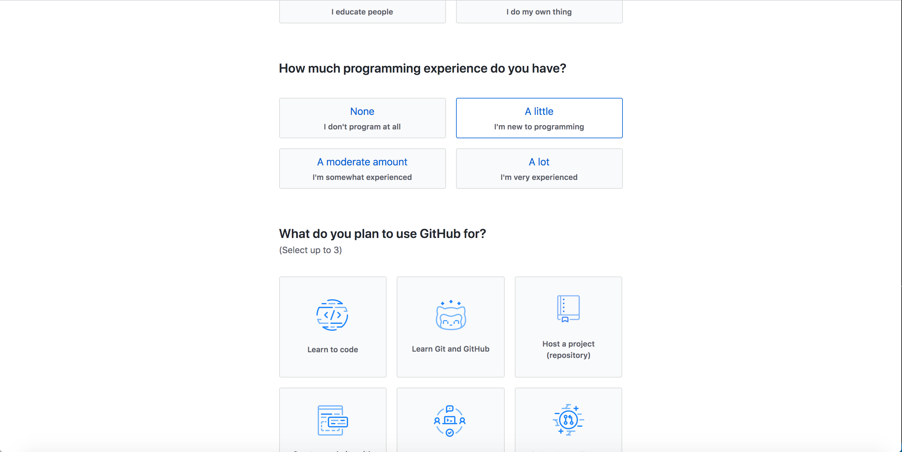<figcaption><b>Paso 3</b> - Selecciona A little en la segunda lista de opciones </figcaption></figure>

<figure><figcaption><b>Paso 4</b> - Selecciona Learn to code, Learn Git and GitHub y School work and student projects en la tercera lista de opciones y luego haz click en Complete setup</figcaption></figure>

<figure>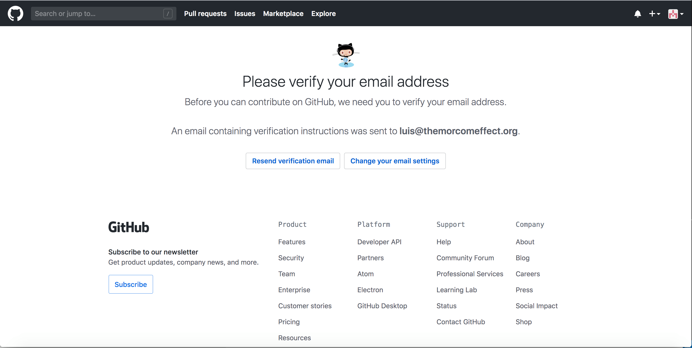</figure>

<figure>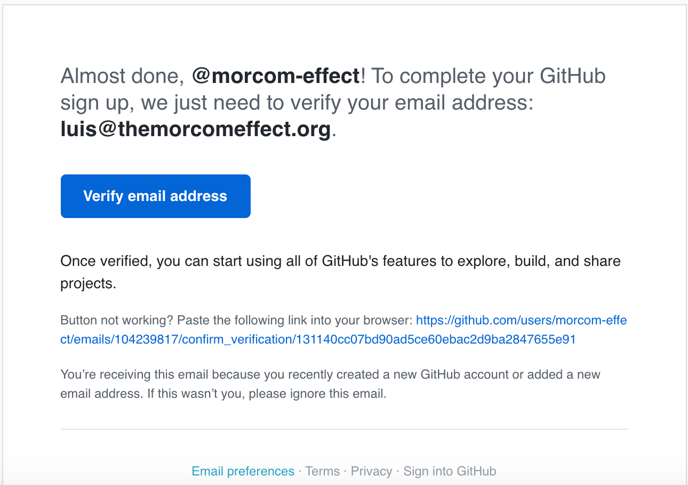<figcaption><b>Paso 5</b> - Ve a tu correo electronico, accesa el email que recibiste de GitHub y haz click en Verify email address  </figcaption></figure>

    
    

