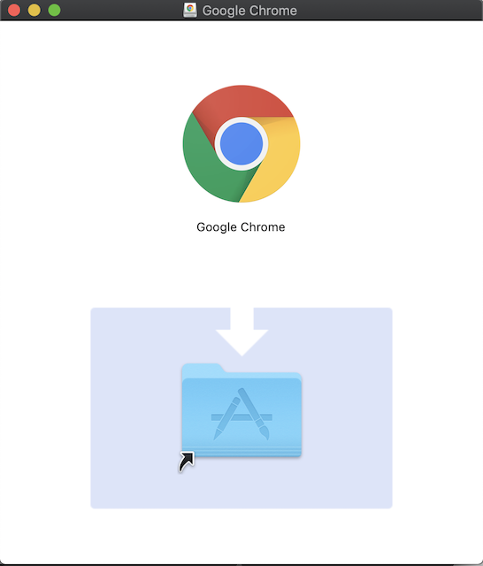
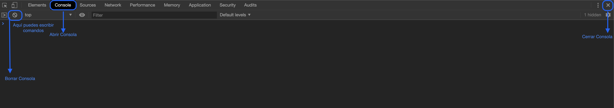
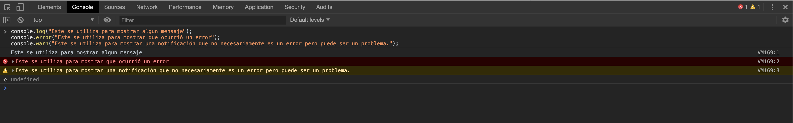
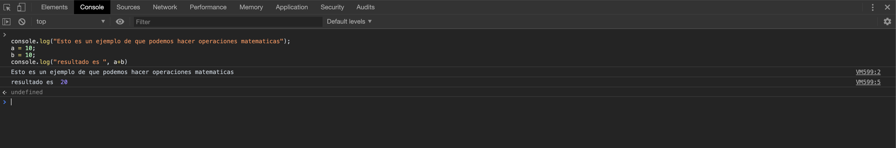
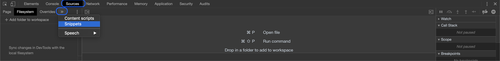
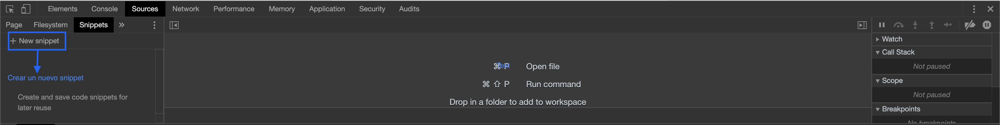
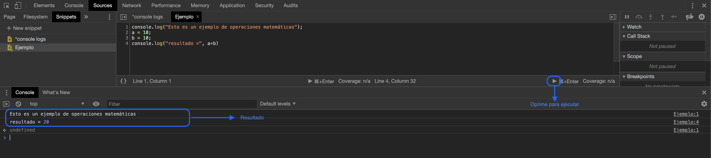

# Navegador Web
Un navegador web es una aplicacion que permite el acceso a la internet. La funcionalidad básica de un navegador web es permitir la visualización de documentos de texto, multimedia entre otros tipos de archivos.

## Instalación del navegador web Chrome 
Abrir [Google](https://www.google.com/)
Escribir "descargar google chrome"
Selecciona el primer enlace que aparece. Oprime el boton que dice "Dercargar Chrome\


Cuando la descarga haya terminado abre el archivo descargado. Mueve el icono de Chrome dentro del archivo de applicaciones.\


## Consola de Chrome
La consola tiene principalment dos funciones: imprimir mensajes y ejecutar codigo JavaScript. 

### Para accesar la consola:
Abre la aplicación Chrome.

#### Opción 1: Presiona Ctrl+Mayús+J (Windows o Linux) o Cmd+Opt+J (Mac).

#### Opción 2: "right click" y selecciona "inspect".

Luego presiona el tab Console.

**Esta imagen muestra algunas operaciones que puedes hacer en esta interface.**

### Funcionalidad de la consola de chrome
#### Ver mensajes escrito por javascript:
La consola permite ver mensajes que sean programados dentro del codigo.\
Para añadir mensajes en tu codigo puedes utilizar las siguientes funciones.

```Js
console.log("Este se utiliza para mostrar algun mensaje");
console.error("Este se utiliza para mostrar que ocurrió un error");
console.warn("Este se utiliza para mostrar una notificación que no necesariamente es un error pero puede ser un problema.");
```

**Resultado**

#### Ejecutar codigo javascript:

##### Forma 1:
Puedes escribir codigo javascript directo en la consola.\
Copia el siguiente codigo y pégalo en la consola.

```Js
console.log("Esto es un ejemplo con operaciones matematicas");
a = 10;
b = 10;
console.log("resultado =", a+b)
```


**Resultado**

Para más información sobre como puedes utilizar la consola: [Documentación Consola](https://developers.google.com/web/tools/chrome-devtools/console)

##### Forma 2: 
Puedes utilizar Snippets
Para accessar tienes que ir a Source tab


**Esta imagen muestra algunas operaciones que puedes hacer en esta interface.**

Luego haz clic en signo + para crear un nuevo snnipet.\
Copia el siguiente codigo en el snippet:
```Js
console.log("Esto es un ejemplo con operaciones matematicas");
a = 10;
b = 10;
console.log("resultado =", a+b)
```

Luego oprime el boton que dice "Run snippet". El resultado sera el mismo que en el ejemplo anterior con la diferencia que ahora tienes el codigo en un file dentro de tu navegador.



Para mayor detalle de las funcionalidades del snippet [Documentación Snippets](https://developers.google.com/web/tools/chrome-devtools/javascript/snippets)

